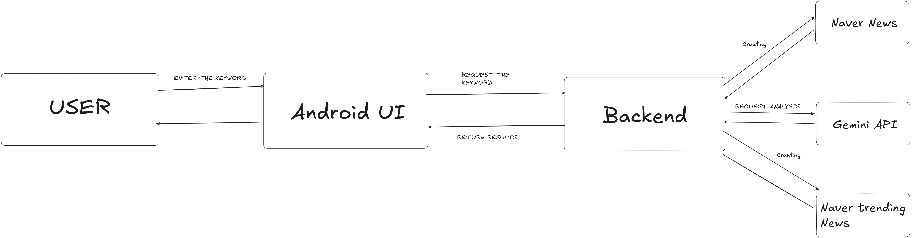

# 🤖 MyAI-Assistant

**MyAI-Assistant** is a smart Android application that analyzes real-time news articles using Gemini API and visualizes the results with sentiment, summary, and keyword highlights. Users can search keywords or select trending topics to receive AI-powered analysis right on their mobile device.

---

## 🗂️ Project Structure

  

---

## ✨ Key Features

- 🔍 **Keyword-based news analysis**  
  Enter a keyword and receive summarized and sentiment-tagged news content.

- 📈 **Trending topic suggestions**  
  Backend fetches and updates real-time trending keywords from Naver.

- 🧠 **AI-powered sentiment analysis & summarization**  
  Using Gemini API to analyze crawled news content.

- 💾 **Bookmark system**  
  Save and view specific results you liked.

- 📊 **Visual feedback**  
  Display result cards with color-coded sentiment & keyword highlights.

---

## 🛠️ Tech Stack

### 📱 Frontend (Android Jetpack Compose)
- Kotlin + Jetpack Compose
- MVVM architecture
- Retrofit2 for network requests
- ViewModel, LiveData
- Room Database (for bookmarks)
- UI features: fade-in animation, scroll-to-top, keyboard control

### 🧠 Backend (Flask)
- Flask REST API
- News Crawling with `requests` + `BeautifulSoup`
- Gemini API integration for NLP
- Cached trending keywords (updated every 30 min)

---

## 🧬 System Flow

1. User enters a keyword or taps a trending keyword.
2. Android app sends a request to the Flask backend.
3. Backend:
   - Crawls Naver News and Naver Trending News.
   - Sends content to Gemini API for summarization and sentiment analysis.
4. Processed result is returned to the Android app.
5. App displays analysis result cards (with background color based on sentiment).

---
## UI Highlights

